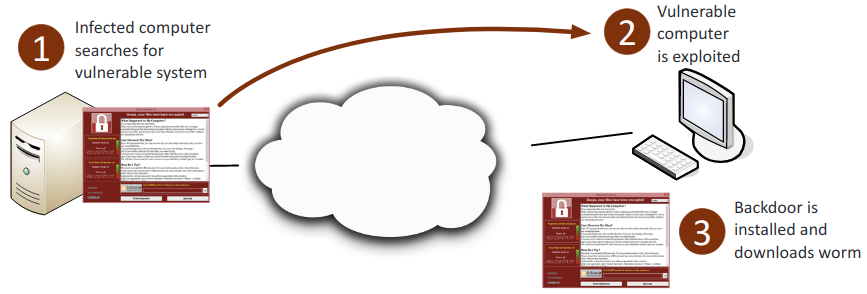
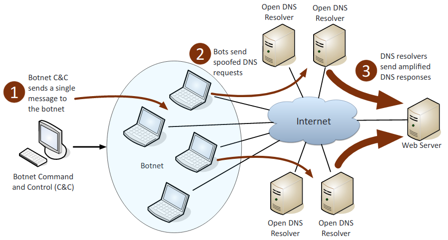
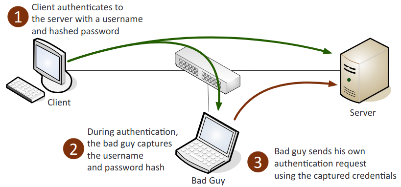
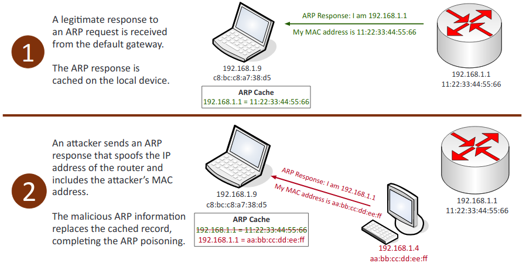

# **1.0 Threats, Attacks and Vulnerabilities**

## 1.1 Given a scenario, analyze indicators of compromise and determine the type of malware.

1. **Malware**: A malicious software that performs bad functions to our computer or other devices on the network.
2. **Viruses**: An unsolicited and unwanted malicious program that can reproduce itself.
3. **Crypto-malware**: A malicious program that encrypts programs and files on the computer in order to extort money from the user.
4. **Ransomware**: Denies access to a computer system or data until a ransom is paid. Can be spread through a phishing email or unknowingly infected website.
5. **Worm**: A self-contained infection that can spread itself through networks, emails, and messages.  

6. **Trojan**: A form of malware that pretends to be a harmless application.
7. **Rootkit**: A backdoor program that allows full remote access to a system.
8. **Keylogger**: A malicious program that saves all of the keystrokes of the infected machine.
9. **Adware**: A program that produces ads and pop ups using your browser, may replace the original browser and produce fake ads to remove the adware in order to download more malware.
10. **Spyware**: Software that installs itself to spy on the infected machine, sends the stolen information over the internet back to the host machine.
11. **Bots**: AI that when inside an infected machine performs specific actions as a part of a larger entity known as a botnet.
12. **RAT** (Remote Access Trojan): A remotely operated Trojan.
13. **Logic bomb**: A malicious program that lies dormant until a specific date or event occurs.
14. **Backdoor**: Allows for full access to a system remotely.

## 1.2 Compare and contrast types of attacks.

1. **Phishing**: Sending a false email pretending to be legitimate to steal valuable information from the user.
    1. **Spear phishing**: Attacks that target specific users with inside information.
    2. **Whaling**: An attack on a powerful or wealthy individual like a CEO.
    3. **Vishing**: An attack through a phone or voice communications.
    4. **Tailgating**: Closely following individuals with keys to get access to secure areas.
    5. **Impersonation**: Taking on the identity of an individual to get access into the system or communications protocol.
    6. **Dumpster diving**: Going through a business’s or person’s trash to find thrown away valuable information or possessions.
    7. **Shoulder surfing**: Watching as a person enters information.
    8. **Hoax**: False information that deceives the user into compromising security by making them believe they are at risk.
    9. **Watering hole attack**: A security attack that targets a specific highly secured group by infecting a commonly visited website by the group’s members.
    10. **Social engineering**: The practice of using social tactics to gain information from people or get people to do something.  
    Principles (reasons for effectiveness):
        1. **Authority**: The actor acts as an individual of authority.
        2. **Intimidation**: Frightening or threatening the victim.
        3. **Consensus**: Convince based on what's normally expected.
        4. **Scarcity**: Limited resources and time to act.
        5. **Familiarity**: The victim is well known.
        6. **Trust**: Gain their confidence, be their friend.
        7. **Urgency**: Limited time to act, rush the victim.
2. Application/service attacks:
    1. **DoS (Denial of Service)**: Flooding a target machine or resource with many requests to overload the system and prevent use of its resources.
    2. **DDoS (Distributed Denial of Service)**: DoS launched from multiple sources.
    3. **Man-in-the-middle**: The attacker alters the communication between two parties who believe they are directly communicating.
    4. **Buffer overflow**: A program attempts to write more data than can be held in a fixed block of memory.  
        
    5. **Injection**: Occurs from processing invalid data, inserts code into the vulnerable computer program and changes the course of execution.
    6. **Cross-site scripting (XXS)**: Found in web applications, allows for an attacker to inject client-side scripts in web pages.
    7. **Cross-site request forgery (XSRF)**: Unauthorized commands are sent from a user that is trusted by the website. Allows the attacker to steal cookies and harvest passwords.
    8. **Privilege escalation**: An attack that exploits a vulnerability that allows them to  gain access to resources that they normally would be restricted from accessing.
    9. **ARP poisoning**: The act of falsifying the IP-to-MAC address resolution system employed by TCP/IP.
    10. **Amplification**: The amount of traffic sent by the attacker is originally small but then is repeatability multiplied to place a massive strain on the victim’s resources, in an attempt to cause it to fail or malfunction.  
        
    11. **DNS poisoning**: Is a type of attack that exploits vulnerabilities in the domain name system (DNS) to divert Internet traffic away from legitimate servers and towards fake ones.
    12. **Domain hijacking**: The act of changing the registration of a domain name without the permission of the victim.
    13. **Man-in-the-browser**: A proxy Trojan horse that infects web browsers and capture browser session data.
    14. **Zero day**: The aim is to exploit flaws or vulnerabilities in targeted systems that are unknown or undisclosed to the world in general. Meaning that there is no direct or specific defense to the attack; which puts most systems vulnerable assets at risk.
    15. **Replay**: Is a network-based attack where a valid data transmission is rebroadcasted, repeated, or delayed.  
        
    16. **Pass the hash**: An authentication attack that captures and uses the hash of a password. The attacker then attempts to log on as the user with the stolen hash. This type of attack is commonly associated with the Microsoft NTLM (New Technology LAN Manager) protocol.
    17. Hijacking and related attacks:
        1. **Clickjacking**: Deceives the user into clicking on a malicious link by adding the link to a transparent layer over what appears to be a legitimate web page.
        2. **Session hijacking**: An attack in which an attacker attempts to impersonate the user by using their legitimate session token.  
        
        3. **URL hijacking**: Redirects the user to a false website based on misspelling the URL, is also referred to **typosquatting**.
    18. **Driver manipulation**:
        1. **Shimming**: The process of injecting alternate or compensation code into a system in order to alter its operations without changing the original or existing code.
        2. **Refactoring**: Rewrites the internal processing of code without changing its behavior.
    19. **MAC spoofing**: The attacker falsifies the MAC address of a device.
    20. **IP spoofing**: An intruder uses another site's IP address to masquerade as a legitimate site.  
        
3. Wireless attacks:
    1. **Replay**: This is a passive attack where the attacker captures wireless data, records it, and then sends it on to the original recipient without them being aware of the attacker's presence.
    2. **IV (Initialization Vector)**: A random number used to increase security by reducing predictability and repeatability.
    3. **Evil twin**: Has same SSID (Service Set Identifier) as a proper access point (AP). Once a user connects to it, all wireless traffic goes through it instead of the real AP.
    4. **Rogue AP (Access Point)**: An unauthorized WAP (Wireless Access Point) or Wireless Router that allows for attackers to bypass many of the network security configurations and opens the network and its users to attacks.
    5. **Jamming**: Disabling a wireless frequency with noise to block the wireless traffic.
    6. **WPS (WiFi Protected Setup)**: Allows users to easily configure a wireless network, sometimes by using only a PIN. The PIN can be found through a brute force attack.
    7. **Bluejacking**: Sending unauthorized messages to a Bluetooth device.
    8. **Bluesnarfing**: Gaining unauthorized access to, or stealing information from a Bluetooth device
    9. **RFID** (Radio Frequency Identifier): Communicates with a tag placed in or attached to an object using radio signals. Can be jammed with noise interference, the blocking of radio signals, or removing/disabling the tags themselves.
    10. **NFC (Near Field Communication)**: A wireless technology that allows for smartphones and other devices to establish communication over a short distance.
    11. **Disassociation**: Removes clients from a wireless network.
4. Cryptographic attacks
   1. **Birthday**: Used to find collisions in hashes and allows the attacker to be able to create the same hash as the user. Exploits that if the same mathematical function is performed on two values and the result is the same, then the original values are the same.
   2. Known plain text/cipher text:
       1. **Plain text**: The attacker has both the plaintext and its encrypted version.
       2. **Cipher text**: The attacker has access only to the encrypted messages.
   3. **Rainbow tables**: Large pregenerated data sets of encrypted passwords used in password attacks.
   4. **Dictionary**: A password attack that creates encrypted versions of common dictionary words and then compares them against those in a stolen password file. Guessing using a list of possible passwords.
   5. **Brute force**: A password-cracking program that tries every possible combination of characters through A to Z.
       1. Online: Is against a live logon prompt.
       2. Offline: The attack is working on their own independent computers to compromise a password hash.
   6. **Collision**: When two different inputs produce the same hash value.
   7. **Downgrade**: Forces a system to lessen its security, this allows for the attacker to exploit the lesser security control. It is most often associated with cryptographic attacks due to weak implementations of cipher suites. Example is TLS > SSL, a man-in-the-middle POODLE attack exploiting TLS v1.0 - CBC mode.
   8. **Replay**: The attacker captures network packets and then retransmits them back onto the network to gain unauthorized access.
   9. **Weak implementations**: The main cause of failures in modern cryptography systems are because of poor or weak implementations instead of a failure caused by the algorithm itself.

## 1.3 Explain threat actor types and attributes.

1. Types of actors:
    1. **Script kiddies**: A person who uses pre-existing code and scripts to hack into machines, because they lack the expertise to write their own.
    2. **Hacktivist**: An individual who is someone who misuses computer systems for a socially or politically motivated agenda. They have roots in the hacker culture and ethics. Hacker on a mission.
    3. **Organized crime**: These are professionals motivated ultimately by profit. They have enough money to buy the best gear and tech. Multiple people perform specific roles: gathering data, managing exploits, and one who actually writes the code.
    4. **Nation states/APT**: An APT is an advanced persistent threat, these are massive security risks that can cost companies and countries millions of dollars. Nation states have very sophisticated hacking teams that target the security of other nations. They often attack military organizations or large security sites, they also frequently attack power plants.
    5. **Insiders**: Someone who is inside the company who has intricate knowledge of the company and how its network works. They can pinpoint a specific vulnerability and may even have access to multiple parts of the network.
    6. **Competitors**: Rival companies, can bring down your network or steal information through espionage.
2. Attributes of actors:
    1. **Internal/external**: Internal is inside the company, can be intentional, unintentional. External is someone outside the company trying to get in.
    2. **Level of sophistication**: Is the skill of the hacker and the complexity of the attack.
    3. **Resources/funding**: The amount of money and the value of the tech and gear being used.
    4. **Intent/motivation**: The reason for the attack, can be for political, monetary, or social reasons.
    5. **Use of Open-source intelligence (OSINT)**: Data that is collected through publicly available information. This can be used to help make decisions. Can be used by threat actors to help find their next target or how to best attack their target. OSINT is also incredibly helpful for mitigating risks and for identifying new threat actors.

## 1.4 Explain penetration testing concepts.

1. **Active reconnaissance**: Is the use of tools to send data to systems and then understanding their responses. Usually starts with various network and vulnerability scanners. Can be incredibly illegal and should not be engaged without being prepared and proper authorization.
2. **Passive reconnaissance**: You are not touching any of the target’s equipment. Instead you are going through and gathering that is already available. Forums and social media are great sources for gathering information about the company and its employees.
3. **Pivot**: In penetration testing it is using a compromised machine to attack other machines on the same network. Attacking and gaining access to an area of lower security in order to be more likely to have a successful attack on an area of greater security. Is also referred to as island hopping.
4. **Initial exploitation**: Usually the hardest part. A vulnerability is taken advantage of to get into the network or system.
5. **Persistence**: Installing backdoors or methods to keep access to the host or networks.
6. **Privilege escalation**: Allows for a user to get a higher-level access than what authentication allows for. Can be resolved through patching and updating. Typically related to a bug or vulnerability 
7. **Black box**: The pentester knows nothing about the network and  have no prior knowledge.
8. **White box**: The pentester have full knowledge of the configurations allowing you to perform specific tests.
9. **Gray box**: Some knowledge of the network; a mix of black and white.
10. **Penetration testing vs. vulnerability scanning**: Penetration testing is an active attack on the network to exploit vulnerabilities, can assess potential damages and the potential of the exploits being found. Is done by a human. Vulnerability scans passively scans and identifies vulnerabilities. Is automated.

## 1.5 Explain vulnerability scanning concepts.

1. **Passively test security controls**: Uses an automated vulnerability scanner. Observes and reports findings. Does not take down systems, applications, or services, and doesn’t disrupt business.
2. **Identify vulnerability**: Understanding common attacks and taking inventory of vulnerabilities. Scanners can report: missing updates, misconfigured security settings, and known exploits.
3. **Identify lack of security controls**: Vulnerability scanners can identify missing patches or antivirus.
4. **Identify common misconfigurations**: Weak passwords, default usernames and passwords, and open ports.
5. **Intrusive vs. non-intrusive**: Intrusive testing can interrupt service, is much more detailed, and exploits vulnerabilities. Non-intrusive is more passive, does not exploit vulnerabilities, and does not disrupt service.
6. **Credentialed vs. non-credentialed**: Credentialed are done as though it is inside the network, emulates an insider attack. Non-credentialed are done as though it is outside the network, emulates an outside attack. Shows what would be found if the network was scanned.
7. **False positive**: A result which shows incorrectly that a condition or attribute is present. A false vulnerability.

## 1.6 Explain the impact associated with types of vulnerabilities

1. **Race conditions**: The behavior of a software, electronic, or another system’s output is dependent on the timing, sequence of events, or a factor out of the user’s control.  
Vulnerabilities due to:
    1. **End-of-life systems**: No longer receives updates, and at a high risk to compromise.
    2. **Embedded systems**: Programs added for automation and/or monitoring. Can allow for malicious programs to gain access through the added programs.
    3. **Lack of vendor support**: Vendor does not support the product: does not update, improve, or protect the product.
2. **Improper input handling:** The system does not properly validate data, allows for an attacker to create an input that is not expected. Allows for parts of the system vulnerable to unintended data.
3. **Improper error handling**: The error messages display sensitive or private information that give the user too much data.
4. **Misconfiguration/weak configuration**: If there is a door left open, hackers will find it.
5. **Default configuration**: Uses the unsecure out-of-box settings.
6. **Resource exhaustion**: A denial of service occurs, the amount of resources to execute an action are expended, making it unable for the action to be performed.
7. **Untrained users**: Users are not properly informed on how to use the systems. This means that mistakes will more likely occur and that the system’s resources may be abused.
8. **Improperly configured accounts**: Users should only be allowed to access the parts that they need to complete their work.
9. **Vulnerable business processes**: All tasks, procedures, and functions should be properly assessed and the most valuable and vulnerable should be heavily protected.
10. **Weak cipher suites and implementations**: Use of older and less robust cryptographic algorithms. EX. DES, WEP.
11. Memory/buffer vulnerability:
    1. **Memory leak**: Unused memory is not properly released. Leaves the system unresponsive.
    2. **Integer overflow**: Large integer exceeds data storage capacity.
    3. **Buffer overflow**: Too much data for the computer’s memory to buffer.
    4. **NULL Pointer dereference**: Failed deference can cause memory corruption and the application to crash.
    5. **DLL injection**: The attacker injects a DLL into a system's memory allowing for executing code.
12. **System sprawl/undocumented assets**: Lack of internal inventory and allowing unsecure devices and systems to connect to the network.
13. **Architecture/design weaknesses**: An insecure and poorly designed network. Ex. Not segmenting the systems or internal network.
14. **New threats/zero day**: A zero-day threat, is a flaw that is unknown to the teams patching and fixing flaws.
15. **Improper certificate and key management**: Allowing for unauthorized access to certificates and keys, which allows for sensitive data to be decrypted. And allowing for certificates to expire.
