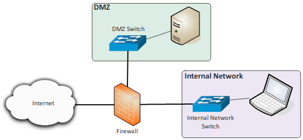
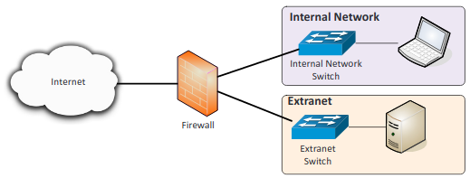
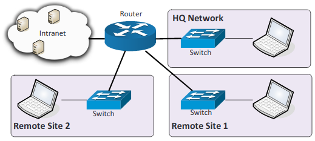
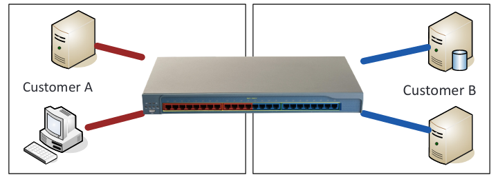
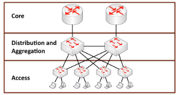

# **3.0 Architecture and Design**

## 3.1 Explain use cases and purpose for frameworks, best practices and secure configuration guides.

1. Industry-standard frameworks and reference architectures:
    1. **Framework**: Is a collection of standardized policies, procedures and guides, meant to direct a: user, firm, or any organization.
    2. **Regulatory**: Is a framework that is based on mandated laws and regulations. HIPAA is an example of this.
    3. **Non-regulatory**: The common standards and best practices that the organization follows.
    4. National vs. international:
        1. **National**: Framework based on the laws of a single country.
        2. **International**: Framework based on the laws of multiple countries.
    5. **Industry-specific frameworks**: Frameworks based on the standards and regulations of a certain industry.
2. **Benchmarks/secure configuration guides**: Instructions that have been developed over years that are designed to give organizations the best and most secure configurations for a particular system.
    1. **Platform/vendor-specific guides**: Hardening guides that are specific to the software or platform, also you can get feedback from the manufacturer or internet interest groups. System default configurations are unsecured and at high risk for exploits.
        1. **Web server**: Web application firewall (WAF), DMZ, Reverse Proxy for incoming communication from the internet to the server.
        2. **Operating system**: Implement a change management policy.
        3. **Application server**: Securing an application server means using industry standard guides, vendor specific, locking down the server to only the ports it needs for its specific role.
        4. **Network infrastructure devices**: Use national vs international guides, regulatory/non-regulatory and general purpose guides for securing.
    2. **General purpose guides**: Security configuration guides that are generic in scope.
3. Defense-in-depth/layered security:
    1. **Vendor diversity**: The practice of implementing security controls from different vendors to increase security. Reduces the impact of company specific vulnerabilities.
    2. **Control diversity**: The use of technical controls, administrative controls, and physical controls to harden security.
        1. **Administrative**: Mandated standards set by organizational policies or other guidelines.
        2. **Technical**: Technologies that reduce vulnerabilities, examples of this are: encryption, antivirus software, IDSs/IPS, and firewalls.
    3. **User training**: Providing regular training to users on common threats, emerging threats, and social engineering in to raise awareness and help avoid attacks.

## 3.2 Given a scenario, implement secure network architecture concepts.

1. Zones/topologies:
    1. **DMZ** (Demilitarized Zone): An additional layer of protection to protect one from the internet.  
       
    2. **Extranet**: Private network that can only be accessed by authorized individuals. Links a company with its suppliers and customers.  
       
    3. **Intranet**: A private network that exclusively for the use of the members of the organization, cannot be accessed by anyone outside the organization.  
       
    4. **Wireless**: Generally, requires a login, an example is an internal wireless network at work.
    5. **Guest**: Network with access to the internet but no access to the internal network. Is useful in congested areas and is generally unsecured.
    6. **Honeynets**: Dummy Network to attract and fool attackers.
    7. **NAT** (Network Address Translation): Translates private IP addresses in to public and public IP addresses to private.
    8. **Ad hoc**: A wireless network without an access point, the connected devices communicate directly.
2. **Segregation/segmentation/isolation**: Separation for performance, security, or compliance
    1. **Physical**: Devices are separate and cannot directly communicate unless physically connected. Does not scale well.  
       
    2. **Logical** (VLAN): Separate areas are segmented for different networks, but still housed on the same switch. To connect them you need a layer 3 device, such as a router.  
       
    3. **Virtualization**: The hardware to separate networks is virtualized, including routers, switches, and other devices apart from the infrastructure. Easier to manage from a security standpoint and everything can be segmented.
    4. Air gaps: Network where the devices are physically separate from another and don’t share any components to **communicate**. Great for security but be careful with removable media.
3. **Tunneling/VPN**:
    1. **Site-to-site**: Send data between two sites in an encrypted form. Done by installing a VPN on both sides. Data will reach the VPN and encrypt and then the other VPN will decrypt it for the receiving end.  
       
    2. **Remote access** (Host to Site): Software is installed on the device that wants the VPN tunnel, then the encrypted tunnel is created to connect to the specific network.  
       
4. Security device/technology placement:
    1. **Sensors**: Can give transactions, logs, or other raw data. Can be integrated or built-into switches, servers, firewalls, routers, or other network devices.
    2. **Collectors**: Could be a console or SIEM. Gathers all the data from sensors into one place and attempts to make sense of it.
    3. **Correlation engines**: Can be built in SIEM, tries to compare and correspond data collected from the sensors to determine if an attack is present.
    4. **Filters**: Follow the logical path, does not follow a state set of rules for traffic. Blocks harmful traffic.
    5. **Proxies**: Intermediary point between the client and the service. Ensures that the response arrives safely and that the traffic flow is correct.
    6. **Firewalls**: Is state-based so that it can filter by content and more specific perimeters. Placed on the outgoing and inward edges of the network.
    7. **VPN concentrators**: Authenticates VPN clients and establishes between tunnels.
    8. **SSL accelerators**: Offloads the SSL process to a hardware accelerator. SSL handshake is complicated and time consuming.  
       
    9. **Load balancers**: Takes requests from the internet, and spreads the requests over multiple servers, can also determine the health of servers.
    10. **DDoS mitigator**: Sits between the network and the internet. Identifies and blocks DDOS attacks in real time.
    11. **Aggregation switch**: Uplinks to upper layer core switch and links down to the access switch.  
        
    12. **Taps and port mirror**: Physical tap sees what is happening in traffic packets, and software port mirror sends a copy of the traffic packets. Is better for light traffic.
5. **SDN** (Software Defined Networking): Aims to separate the hardware layer from the control. The network is fully virtualized with software, and then separated into the control (configuration) and data plane (forwarding and firewalling). Directly programmable from a central location, often automatically.

## 3.3 Given a scenario, implement secure systems design.

1. Hardware/firmware security:
    1. **FDE** (Full Disk Encryption)/**SED** (Self Encryption Drives): Programs and technologies that encrypt everything on the storage drive.
    2. **TPM** (Trusted Platform Module): A chip on the motherboard designed to protect hardware through integrated cryptographic keys.
    3. **HSM** (Hardware Security Module): Accelerates cryptographic operations and manages cryptographic keys, can be implemented as a physical device and used to accelerate RSA-based operations.
    4. UEFI / BIOS:
        1. **UEFI** (Unified Extensible Firmware Interface): A method used to boot some systems and is intended to succeed BIOS. Improves upon the BIOS design by: allowing support for larger hard drives, having faster boot times, providing enhanced security features, and giving the user the ability to use a mouse when making system changes.
        2. **BIOS** (Basic Input/Output System): Basic low-end firmware or software that provides a computer with the basic instructions on how to start.
    5. **Secure boot** and attestation: Processes that checks and validates system files during the boot process.
    6. **Supply chain**: The process of getting a product or a service from the beginning supplier to the user.
    7. **Hardware root of trust**: Shows that there was a secure starting point, this is proved by TPMs having a private key burned into the hardware.
    8. EMI/EMP:
        1. **EMI** (Electromagnetic Interference): Electromagnetic interferences caused by devices that can corrupt data or prevent data from being transferred.
        2. **EMP** (Electromagnetic Pulse): A short burst of electromagnetic energy
2. **Operating systems**:
    1. Types:
        1. **Network**: Supports servers, workstations, and other network-connected devices.
        2. **Server**: Designed to function as a server.
        3. **Workstation**: Optimized for user applications such as email and office apps.
        4. **Appliance**: A system designed to serve a purpose.
        5. **Kiosk**: A system or computer with a touch screen designed to provide information or directions.
        6. **Mobile OS**: The OS of phones, tablets, and other handheld devices.
    2. **Patch management**: Keeping systems up to date to help improve stability and security.
    3. **Disabling unnecessary ports and services**: Disabling unnecessary ports improves security by preventing the users from being able to steal important data through physical storage or injecting viruses through USB. Unnecessary services leave the system vulnerable to viruses and exploits.
    4. **Least functionality**: Limiting the operating system to be able to perform what is necessary.
    5. **Secure configurations**: Changing the unsecure default setting to protect the system.
    6. **Trusted operating system** (TOS): provides sufficient support for multilevel security and evidence of correctness to meet high security standards.
    7. **Application whitelisting/blacklisting**: Protects the system from potentially dangerous applications.
        1. **Whitelisting**: Applications allowed on the system.
        2. **Blacklisting**: Applications blocked by the system.
    8. **Disable default accounts/passwords**: Are easily guessable and must be changed immediately to prevent unauthorized access.
3. Peripherals:
    1. **Wireless keyboards**: Operate in the clear allowing for the capturing of keystrokes with a receiver to be controlled remotely.
    2. **Wireless mice**: Operate in the clear allowing for the capturing of movements or to be controlled remotely.
    3. **Displays**: Vulnerable to shoulder surfing, firmware hacks, and eavesdropping.
    4. **WiFi-enabled MicroSD cards**: Portable storage device that has access to 802.11 Wi-Fi file transfers.
    5. **Printers/MFDs** (Multi-Function Devices): Reconnaissance can be performed by going through the saved logs.
    6. **External storage devices**: No authentication allows for anyone to read, write and move files.
    7. **Digital cameras**: Easy to steal data.

## 3.4 Explain the importance of secure staging deployment concepts.

1. **Sandboxing**: Virtualizes a deployment process, allows for machines to be completely isolated from each other, and is similar to the environment that will be used.
2. **Environment**: Usually tested in the actual environment that the product will be used in.
    1. **Development**: Uses a development environment, version control and change management control to track development.
    2. **Test**: Rigid tests are performed to find bugs and errors. Does not simulate the full product.
    3. **Staging**: Uses data that the real product would use. Late stage testing.
    4. **Production**: Application is now live, and the updates will be rolled out.
3. **Secure baseline**: Defines the core of what the development team must do. Lays out what will need to be updated in the future.
4. **Integrity measurement**: Tests against the baseline to keep it secure.

## 3.5 Explain the security implications of embedded systems.

1. **SCADA** (Supervisory Control and Data Acquisition)/**ICS** (Industrial Control System): An ICS is a type of computer-management deceive that controls industrial procedures and machines. A SCADA is a system used over multiple industries. SCADAs can be protected with VLANs and NIPS, and they require extensive network segmentation.
2. **Smart devices/IoT** (Internet of Things): A mobile device that allows the user: customizable options, applications to help make daily activities easier, and an AI to assist in tasks. The IoT is the class of devices that help provide automation and remote control of appliances and devices in the home or office.
    1. **Wearable** technology: Contains personal and health information on a person.
    2. **Home** automation: Technology in the home is not updated frequently and are susceptible to attacks.
3. **HVAC**: Heating, ventilation, and air conditioning.
4. **SoC** (System on a Chip): An embedded device where the entire system is on the chip.
5. **RTOS** (Real Time Operating System): Attempts to use predictability to see what happens to meet real time requirements, the guesses must be secured.
6. **Printers/MFDs**: Contains logs, documents, and sensitive information that can be accessed and stolen.
7. **Camera systems**: Videos recorders and cameras are IP devices. The risk is that they can be hacked.
8. Special purpose:
    1. Medical devices: Can be attacked leaving patients at risk.
    2. Vehicles: Contains onboard Wi-Fi vulnerable to threats.
    3. Aircraft/UAV: Can have communications intercepted.

## 3.6 Summarize secure application development and deployment concepts.

1. Development life-cycle models:
    1. **Waterfall**: Not flexible, done in stages, and cannot go back to a previous stage once the next stage is started.
    2. **Agile**: Flexible: allows for collaboration between groups, and can go back and fix previous iterations.
2. Secure **DevOps**:
    1. Security automation: Tools that automatically tests security functions, penetration, and for vulnerabilities.
    2. Continuous integration: The basic set of security checks while developing.
    3. Baselining: Comparing current performance to previously set metric
    4. Immutable systems: Are locked and unable to change. To update the entire platform must be updated.
    5. Infrastructure as code: Turns the devices into code to allow for focusing on the application needs instead of based on available infrastructure.
3. **Version control** and change management: The ability to track change and ability to revert to previous versions.
4. **Provisioning and deprovisioning**: The adding and removing of assets over time. Installing new devices and uninstalling old ones.
5. **Secure coding techniques**:
    1. **Proper error handling**: Errors do not crash the system, allow for elevated privileges, or expose private information.
    2. **Proper input validation**: Sanitizing data to make sure it is correct and secure before using.
    3. **Normalization**: Applying rules to a database design to ensure that the proper information goes in the proper places.
    4. **Stored procedures**: A program in the database that enforces the business rules.
    5. **Code signing**: Assigning a digitally signed certificate to code.
    6. **Encryption**: Converting readable code to unreadable garbage to make it secure.
    7. **Obfuscation/camouflage**: Making code difficult to read.
    8. **Code reuse/dead code**: Reusing code in multiple contexts. Code that cannot be executed.
    9. Server-side vs. client-side execution and validation:
       1. **Server-Side**: Code runs on the server.
       2. **Client-Side**: Code runs in the browser, is highly vulnerable to attacks.
    10. **Memory management**: Checking and ensuring that the program does not use too much memory.
    11. **Use of third-party libraries and SDKs**: Commonly used so is better understood by attackers.
    12. **Data exposure**: Disclosing private information to attackers.
6. Code quality and testing:
    1. **Static code analyzers**: Checks source code for: conformance to coding standards, quality metrics, and for data flow anomalies.
    2. **Dynamic analysis** (e.g., fuzzing): Providing unexpected inputs to cause the application to crash.
    3. **Stress testing**: Seeing how many users a program can handle at a time.
    4. **Sandboxing**: Using a virtual machine to run the program in a simulated environment to determine if it will properly run. Does not affect production equipment.
    5. **Model verification**: Ensuring the program meets specifications and performs its purpose.
7. Compiled vs. runtime code:
    1. **Compiled Code**: Code that is optimized by an application and converted into an executable.
    2. **Runtime Code**: The code that is interpreted as it runs.

## 3.7 Summarize cloud and virtualization concepts.

1. **Hypervisor**: A software, firmware or hardware that creates, manages, and operates virtual machines.
    1. **Type I**: Known as bare metal, runs on the hardware.
    2. **Type II**: Known as hosted, runs on top of the operating system.
    3. **Application cells/containers**: Abstracting applications from the platform into containers allowing for applications to run without launching an entire virtual machine. This provides portability and isolation, and less overhead than VM.
2. **VM sprawl avoidance**: The avoiding of a VM getting too large for the admin to properly manage. To avoid it the admin should: enforce a strict process for deploying VMs, have a library of standard VM images, archive or recycle under-utilized VMs, and implement a Virtual Machine Lifecycle management Tool.
3. **VM escape protection**: The avoiding of an attacker accessing the host system from within the VM. To avoid it: keep hosts and guests up to date with current patches.
4. **Cloud storage**: The process of storing data in an off-site location that is leased from a provider.
5. Cloud deployment models:
    1. **SaaS** (Software as a Service): The customer uses software that is not locally stored, instead, all of that service is being provided in the cloud. Ex. Google docs or Gmail. Everything is managed by the provider.
    2. **PaaS** (Platform as a Service): Also known as software as a service.
        1. Managed by customer: Data, applications, and making sure apps run on the OS
        2. Managed by provider: Runtime, middleware, OS, virtualization, servers, storage, and networking.
    3. **IaaS** (Infrastructure as a Service): Also known as hardware as a service,
        1. Managed by customer: Software (applications, data, Runtime, middleware, and operating system).
        2. Managed by provider: Hardware (virtualization, servers, storage, and networking).
    4. **Private**: Deployed within the organization by the organization for the organization.
    5. **Public**: Cloud is deployed by the provider within their organization for other organizations to use.
    6. **Hybrid**: A combination of public and private replication.
    7. **Community**: Private or public but only shared between trusted groups.
6. On-premise vs. hosted vs. cloud:
    1. **On-premise**: Built and managed by the company’s data center. Allows for complete control over it. Has a high investment cost and operational cost.
    2. **Hosted**: Leasing the network and storage that is off site. Access and availability depends on the design. Has No investment cost, and a moderate operational cost
    3. **Cloud**: Leasing the network and storage that can be on or off site. Has no investment cost, and a low operational cost. Can be accessed anywhere, anytime and has high mobility.
7. **VDI** (Virtual Desktop Infrastructure)/**VDE** (Virtual Desktop Environment): The virtualization of a user's desktop where the applications are running in the cloud or in a data center, the user runs as little of the application as possible on the local device.
8. **Cloud access security broker**: Allows for the integration of security policies across all cloud-based applications. Let’s the provider see that applications are in use and users associated with them. Can be installed on premise or on the cloud server.
9. **Security as a service** (SECaaS): The provider implements their security services into your environment via the cloud, such as: authentication anti-virus, anti-malware, IDS, and event management.

## 3.8 Explain how resiliency and automation strategies reduce risk.

1. Automation/scripting:
    1. **Automated courses of action**: Automated scripts that give a basis for secured configuration with a secured template. Can be configured to accommodate for constant changes or can be launched on a specific schedule.
    2. **Continuous monitoring**: Monitors IDS/ logs, networks, SIEMs, and other systems for changes and threats.
    3. **Configuration validation**: Reviewing the settings of the system to ensure that its security settings are configured correctly.
2. **Templates**: Gives a basis for secured configuration with a standard secured configuration.
3. **Master image**: Is crafted configuration of a software or entire system. Created after the target system is installed, patched, and configured.
4. **Non-persistence**: Changes are possible. Due to risks of unintended changes, multiple protection and recovery options must be established.
    1. **Snapshots**: A copy of the live current operating environment.
    2. **Revert to known state**: Is a recovery process that goes back to a previous snapshot.
    3. **Rollback to known configuration**: Just a collection of settings. Does not usually include software elements.
    4. **Live boot media**: A portable storage device that can boot a computer. Is read-to-run or a portable version of the OS.
5. **Elasticity**: The ability for the system to adapt to a workload by allocating and providing resources in an automatic manner.
6. **Scalability**: The ability to handle an ever-increasing workload and able to accommodate future growth.
7. **Distributive allocation**: Is providing resources across multiple services or servers as necessary instead of preallocation or concentrated resources based on physical system location.
8. **Redundancy**: Secondary or alternate solutions, it’s an alternate means to complete tasks. Helps reduce single points of failure and boosts fault tolerance.
9. **Fault tolerance**: The ability for the: network, system, or computer to provide a service while withstanding a certain level of failures. Aids in avoiding a single point of failure, a SPoF is anything that is mission critical.
10. **High availability**: Refers to a system that is able to function for extended periods of time with little to no downtime.
11. **RAID** (Redundant Array of Independent Disks): Is a high availability solution. Employs multiple hard drives in a storage volume with a level of drive loss protection, except for RAID 0.  
     

## 3.9 Explain the importance of physical security controls.

1. **Lighting**: If the perimeter is properly lit it can deter thieves, break-ins, and other criminal activity.
2. **Signs**: Allows for controlled entry point, is a psychological deterrent, and helps new and visitors find their way. Informs of security cameras, safety warnings, and that an area is restricted.
3. **Fencing/gate/cage**: A fence sets the boundaries of the property and protects against casual intruders. Gates allow for controlled entry and exit. Cages protect assets from being accessed by unauthorized individuals.
4. **Security guards**: Humans are adaptable, can adjust to live events, and can react to real time intrusion events. Can intervene and control the security devices.
5. **Alarms**: Notify security personnel and the authorities of unauthorized activities.
6. **Safe**: Protects valuables from thieves and natural disasters.
7. **Secure cabinets/enclosures**: Restricts unauthorized personnel from accessing cabinets.
8. **Protected distribution/Protected cabling**: Is a standard on how to safely transmit unencrypted data. Protects from wire-taps.
9. **Airgap**: Ensure secure networks are physically isolated from unsecure networks.
10. **Mantrap**: Area between two doorways to identify and authenticate individuals.
11. **Faraday cage**: Metal screen to protect equipment from electrostatic and electromagnetic influences.
12. **Lock types**: Can use a key, key-pad, cards, or biometrics.
13. **Biometrics**: Uses physical characteristic, such as a fingerprint, for authentication.
14. **Barricades/bollards**: Stops and guides traffic, it can also prevent the entrance of vehicles.
15. **Tokens/cards**: Items necessary to gain access to secured areas of the building. Can contain information that can identify and authorize an individual.
16. Environmental controls:
    1. **HVAC**: Keeps servers from overheating and shutting down.
    2. **Hot and cold aisles**: Allows for air flow control and for the air to move through the data center strategically.
    3. **Fire suppression**: Protects the equipment from fire, smoke, corrosion, heat, and water damage. Early fire detection is vital for protecting personal and equipment from harm.
17. **Cable locks**: Protects small equipment from theft.
18. **Screen filters**: Reduces the range of visibility to prevent shoulder suffering.
19. **Cameras**: Deters criminal activity and creates a record of events.
20. **Motion detection**: Senses movement and sound in a specific area.
21. **Logs**: Document visitor access, allows for the identifying and record keeping of everyone who has access to the premise.
22. **Infrared detection**: Detects and monitors changes in the temperature.
23. **Key management**: Ensure only authorized individuals only have access to the areas they need to complete their work.
